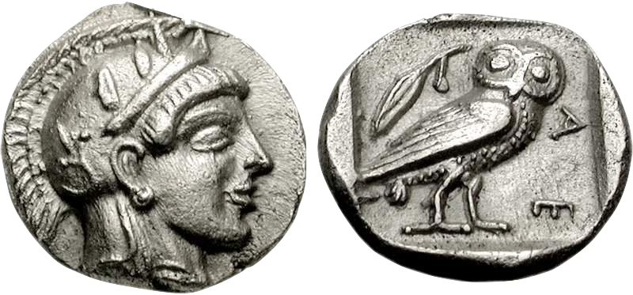

<figcaption>
    Athenian silver obol ca. 450 BC
<a href="https://commons.wikimedia.org/wiki/File:Athens_465-454_BC_Obol.jpg">Source</a>
</figcaption>

# Obol

A simple CLI tool inspired by [Charon](https://github.com/AeneasVerif/charon/) to extract Rust information in ULLBC format. It only handles monomorphic code, but does so slightly faster and with more coverage than Charon, thanks to accessing the compiler's internals directly, rather than passing through [Hax](https://github.com/cryspen/hax/).

This tool is intended for use within [Soteria](https://github.com/soteria-tools/soteria), for Rust whole program symbolic execution, and is heavily oriented towards that, sometimes ignoring otherwise relevant information (like lifetimes or generics). If you want to do compositional analyses, use Charon instead!
